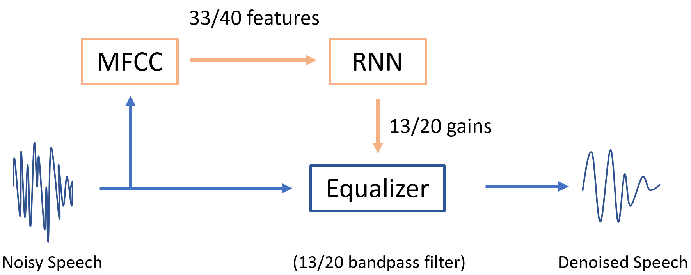
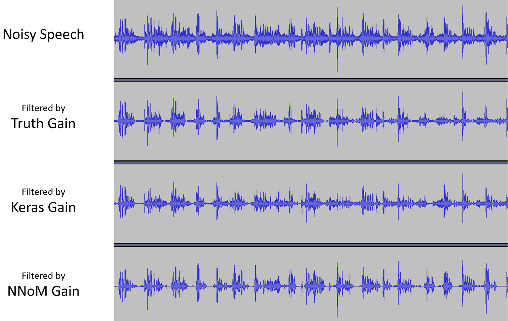
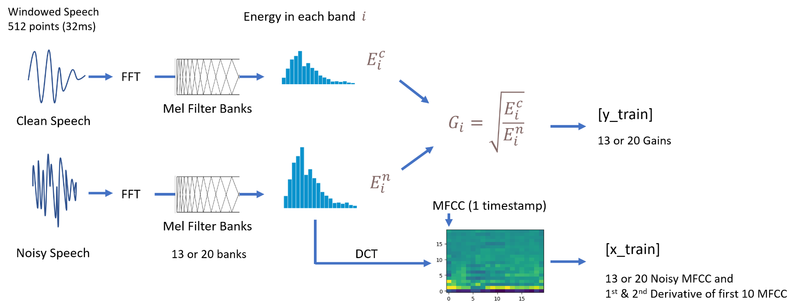
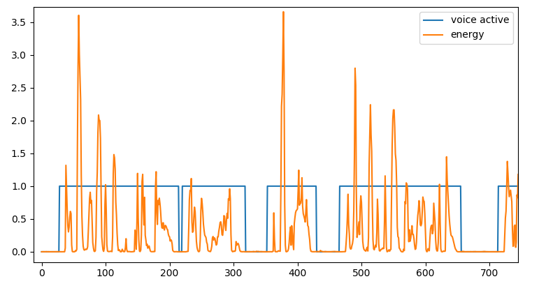
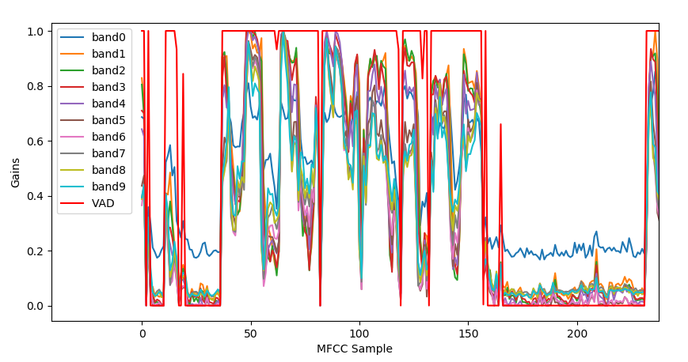
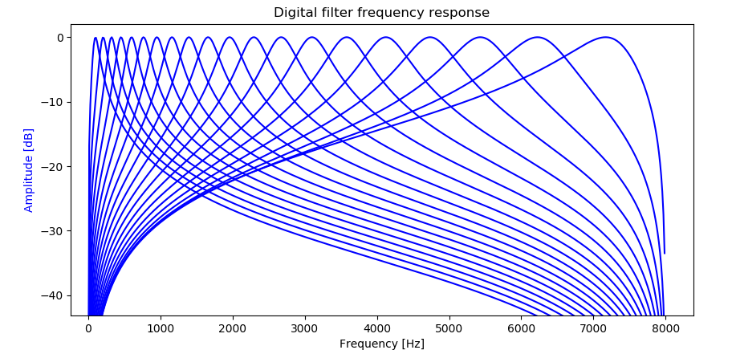
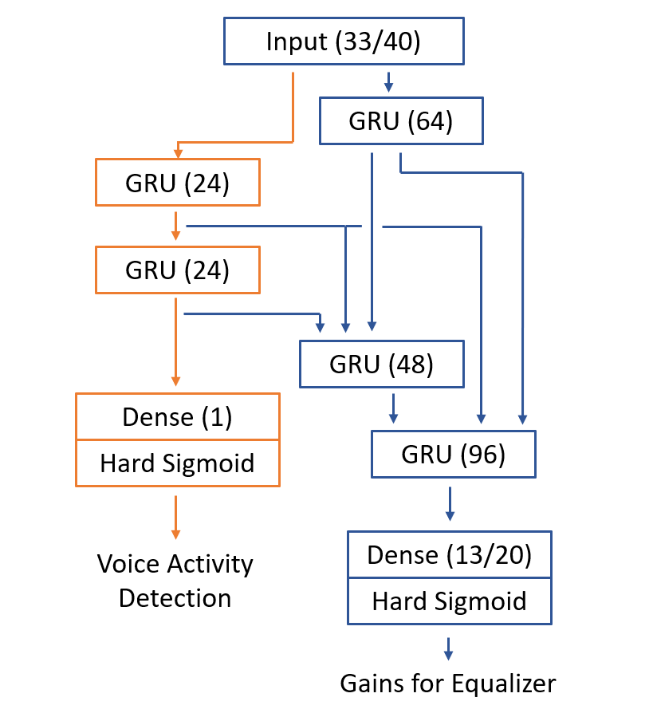

# 单片机 RNN 神经网络实时降噪

这个例子是根据 [RNNoise](https://jmvalin.ca/demo/rnnoise/) 的降噪方法进行设计的。整体进行了一些简化和定点化的一些修改。
虽然是一个例子，但我尽可能罗列了所有需要用到的资源和信息。

与RNNoise主要的不同如下:
- 此例子并非从RNNoise的模型直接转换而来，而是从新基于Keras训练一个新模型，并转化成NNoM模型。
- 音频信号处理去掉了pitch filtering的部分。
- RNN 网络定点化时，根据定点模型的一些特点进行了部分神经网络结构修改。
- 训练数据集选择上使用了微软的可定制语音数据库。

此例子用到的三方库如下，大部分为宽松许可，但请大家在使用时遵循他们的开源协议。

- [RNNoise](https://jmvalin.ca/demo/rnnoise/) 
- [Microsoft Scalable Noisy Speech Dataset](https://github.com/microsoft/MS-SNSD) 
- [python speech features](https://github.com/jameslyons/python_speech_features)
- [arduino_fft](https://github.com/lloydroc/arduino_fft)
- [CMSIS](https://github.com/ARM-software/CMSIS_5)

NNoM本身许可为 Apache-2.0，详细信息请看[NNoM repository](https://github.com/majianjia/nnom).

# 一些背景知识

## 如何用神经网络进行语音降噪？

神经网络降噪通常有两种方式：
- 语音信号直入神经网络模型，神经网络全权进行识别处理并输出降噪后的语音信号。
- 神经网络识别语音和噪音的特征，动态输出增益，使用传统信号处理方法进行滤波。

RNNoise 使用的是第二种方法。

实际进行语音降噪（滤波）的部分，是一个均衡器，也就是大家播放器内调节低音高音的那个玩意儿。而均衡器(Equalizer)的本质是很多个平行的带通滤波器(Bandpass Filter). 我们神经网络的输出，就是均衡器内各个filter band的增益。

那输入是什么？跟之前的 [Key Word Ppotting](https://github.com/majianjia/nnom/tree/master/examples/keyword_spotting) 一样，我们这里使用了梅尔倒频谱 (MFCC)。如果不熟悉的小伙伴，可以回去看看KWS的解释。

跟RNNoise有一些不一样的是我们的例子使用MFCC和梅尔刻度 (Mel-scale) 而不是他们用的OPUS-Scale 或者响度刻度 (Bark-Scale)。单纯从刻度的对比上，他们其实差别不是很大。大家可以去查查他们的区别。

# 运行步骤

## 1.下载语音数据集

这里我们使用的数据集是微软的可定制语音数据集[Microsoft Scalable Noisy Speech Dataset](https://github.com/microsoft/MS-SNSD) (MS-SNSD)。
我们可以定制时长，噪音类型，噪音混合信噪比等。
你需要把整个仓库下载在 `MS-SNSD/`文件夹内。整个数据库有2.x GB大佬们请自行进行github加速。

下载完后，你就可以用它生成我们需要的`干净的语音`和`带噪音的语音`。同时我们还控制了语音混合的程度，也就是信噪比(SNR).

在`MS-SNSD/`目录下修改 `noisyspeech_synthesizer.cfg` 就可以配置数据库，推荐配置如下:
~~~
sampling_rate: 16000
audioformat: *.wav
audio_length: 60 
silence_length: 0.0
total_hours: 15
snr_lower: 0
snr_upper: 20
total_snrlevels: 3  
~~~

*如果打算快速测试一下，可以把total_hour 减少为1或者2小时。*

修改完后，运行 `noisyspeech_synthesizer.py` 就可以生成我们需要的音频WAV文件了。我们需要一对一的`干净的语音`和`带噪音的语音`，它们分别在
`MS-SNSD/CleanSpeech_training` 和 `MS-SNSD/NoisySpeech_training` 内。

## 2. 生成训练数据集

之前一步获取到的是`.wav`文件，而我们训练神经网络使用的是 `MFCC` 和 `gains`。

现在我们可以运行例子提供的`gen_dataset.py`来计算MFCC和gains。它最终会生成一个`dataset.npz`文件。

在这个文件里面，你可以配置这些内容
- 需要MFCC的特征数(同时也会修改均衡器Equalizer的Banpass Filter的数量)。修改 `num_filter = 20`即可。通常数字在`10`到`26`。
- 这个脚本也会生成一个c工程使用的滤波器参数文件`equalizer_coeff.h` (`generate_filter_header(...)`)。在C语音的均衡器中会使用这个头文件。

另外，这个脚本还会生成两个Demo音频。一个叫`_noisy_sample.wav` 另一个叫 `_filtered_sample.wav`。前者为从训练集里面选出的一个带噪音的范例，后者为用`gains`和均衡器滤波后文件。基本上，这个文件代表了这个降噪方法的最好的水平。后文会有详细的说明怎么生成这个`gains`。

## 3. 训练模型

当`dataset.npz`生成后，我们就可以跑 `main.py`来训练Keras模型了。训练好的模型会保存在目录下`model.h5`

因为我们的模型最终要放在单片机上跑，RNN 每次处理一个 timestamp，所以我们的模型设置为`stateful=True` 和 `timestamps=1`。这样的设置对于训练并不是很理想，因为BP没有办法很好的在很小的batch上工作。我们的Batch尽量设置得很大。这里设置`batchsize >= 1024`。

同时，这一步会把我们之前的噪音范例`_noisy_sample.wav` ，使用RNN生成的`gains`来滤波`filtered_sig = voice_denoise(...)`（可以对比我们真实`gains`降噪的结果）。滤波后的文件保存为`_nn_filtered_sample.wav`。

在最后，调用NNoM的API `generate_model(...)` 生成NNoM模型文件 `weights.h`。

## 4. RNN 在 NNoM 上部署

本例提供了`SConstruct`， 所以你可以直接在目录下运行 `scons` 来编译。默认使用目录下的`main.c` 编译成PC可执行程序。支持32/64bit windows。 理论上也支持linux。

这个二进制文件可以直接对 `.wav` 文件降噪并生成一个新的 `.wav`文件，使用方法如下:

> 注意：仅仅支持`16kHz 1CH`的格式。(程序不解析WAV只复制文件头)。

- Win powershell: `.\rnn-denoise [input_file] [output_file]` 或者拖拽.wav 文件到编译完成的`*.exe`上 
- Linux: 大家自己试试

比如，运行这个指令生成定点RNN滤波后的音频：`.\rnn-denoise _noisy_sample.wav _nn_fixedpoit_filtered_sample.wav`

到此，目录下一共有四个音频，大家可以试听一下。 
~~~
_noisy_sample.wav  --> 原始带噪音文件
_filtered_sample.wav  --> 用真实gains降噪的文件(训练的gains)
_nn_filtered_sample.wav   --> Keras浮点模型gains 降噪
_nn_fixedpoit_filtered_sample.wav   --> NNoM定点模型gains降噪
~~~

这里对比了噪音文件和NNoM降噪文件[Bilibili](https://www.bilibili.com/video/BV1ov411C7fi), [Youtube](https://youtu.be/JG0mSZ1ZnrY)

# 细节

总的来说，我推荐大家看 `gen_dataset.py` 和 `main.py`里面的步骤，很多详细的步骤都在注释里面有相关的解释。

## 关于训练数据

`x_train` 里面包含了13或者20个（默认）MFCC，除此之外，还有前10个MFCC特征的第一和第二导数(derivative)。
这些为常用的语音识别特征。所以一共有 33 到 40 个特征。

`y_train` 里面有两组数据，一组是`gains`，另一个叫 `VAD`

- Gains 与RNNoise方法相同，为 clean speech/noisy speech 在每一个band上的能量的开平方。 是一组`0-1`的值，组大小为均衡器的带通滤波器个数。
- VAD 全称叫 Voice Active Detection。为一个`0-1`的值，指示是否有语音。计算方法为检测一个窗口内总能量的大小是否超过一个阈值。

## 关于 Gains 和 VAD

在默认的模型里面，有两个输出，其中一个便是VAD。 在`main_arm.c` (单片机版本的Demo)里面，这个VAD值控制了板子上的一个LED。如果`VAD > 0.5` LED 会被点亮。 

## 关于均衡器

这里使用了20（默认）或者13个带通滤波器(Filter Band)来抑制噪音所在的频率。
实际上你可以设置成任何值不过我推荐大于10小于30。
每一个独立的带通滤波器的`-3dB`点都与它附近的贷通滤波器的`-3dB`点相交。
响频曲线如下:

音频信号会平行地通过这些带通滤波器，在最后把他们相加在一起。
因为滤波器是交叉的，最终混合的信号幅度过大导致数值溢出，所以最终混合的信号会乘上一个`0.6`（并非数学上验证的数值）再保存在`int16` 数组内。

## 关于RNN模型的结构

这里提供了两个不同的RNN模型。
一个是与RNNoise 类似的模型，各个RNN层之间包含很多的支线。这些支线会通过 concatenate 合并在一起。
这个模型还会提供一个VAD输出。整个模型一共约 `120k`的权重。比RNNoise稍高因为做了一些针对定点模型的改变。
其实这个模型有点过于复杂了，我尝试减少模型参数，仍然可以很好的进行降噪。
如图下图所示。

另一个模型是一个简单的多层GRU模型，这个模型不提供VAD输出。
非常震惊的是这个模型也能提供不错的效果。

如果想尝试这个简单的模型，在`main.py`里面修改`history = train(...)` 成 `train_simple(...)`。

Keras的RNN需要把`stateful=True`打开，这样NNoM在每计算一个timestamps的时候才不会重置state。

## MCU 例子

这里提供了一个 MCU 的文件`main_arm.c`。这个文件针对 STM32L476-Discovery 的麦克风做了移植，可以直接使用板载麦克风进行语音降噪。

例子通过一个绿色 LED（PE8）输出VAD检测的结果，有人说话时就会亮。

除了BSP 相关的代码，功能那个上`main_arm.c`与PC代码`main.c`完全一致，
本例虽然做了音频降噪，但是并没有针对音频输出写驱动，所以降噪输出是被直接抛弃了。大家可以自己写保存或者回放的代码。

如果你使用的是 ARM-Cortex M系列的MCU，做以下设置可以提升性能。
- 打开 NNoM 的 CMSIS-NN 后端，参考 [Porting and Optimization Guide](../../docs/Porting_and_Optimisation_Guide.md)
- 在 `mfcc.h`里面，打开 `PLATFORM_ARM` 宏定义来使用ARM_FFT。 

## MCU 上的性能测试

传统的 RNNoise 不止包含了浮点模型，还包括了其他计算（比如pitch filtering），导致总计算量在`40MFLOPS`左右。即是换成定点计算，一般的单片机也会很吃力。

本例中，浮点FFT，定点RNN模型，浮点均衡器（滤波器），并去掉了pitch filtering。
我对这里使用的几个运算量大的模块进行了测试，分别是MFCC部分(包含FFT)，神经网络部分，还有均衡器。

测试环境为
- Board: [STM32L476-Discovery](https://www.st.com/en/evaluation-tools/32l476gdiscovery.html)
- MCU: STM32L476, 超频到 140MHz Cortex-M4F
- 音频输入: Embedded Microphone
- 音频输出: 无
- IDE: Keil MDK

测试条件: 
- 神经网络后端: CMSIS-NN 或 Loacl C Backend
- FFT 库(512点): `arm_rfft_fast_f32` 或 纯FFT [arduino_fft](https://github.com/lloydroc/arduino_fft)
- 优化等级: `-O0/-O1` 或 `-O2`
- 均衡器滤波器数目: `13 band` 或者 `20 band`

> 需要注意的是，这里使用的音频格式为 `16kHz 1CH`，所以我们每次更新(FFT窗口:512， 窗口overlapping=50%)只有`256/16000 = 16ms` 的时间来完成所有的计算。

**13 Band Equalizer**

| NN backend| 512-FFT | Opt | MFCC(ms) | Network(ms) |Equalizer(EQ)(ms)| Total(ms) | Comment|
| ------ | --- | ------ | ------ | ------| ------|  ------| ------|
|cmsis-nn|arm_fft| -O1| 0.63 | 3.34 | 2.75 | 7.11 |  |
|cmsis-nn|arm_fft |-O2| 0.56 | 3.3 | 2.27 | 6.18 |  |
|local|arm_fft|-O1| 0.63 | 7.78 | 2.75| 11.19 |  |
|local|arm_fft|-O2| 0.55 | 7.78| 2.27| 10.65|  |
|local|arduino_fft| -O0| 2.54 | 7.94 | 4.03| 14.57 ||
|local|arduino_fft| -O2| 1.89 | 7.78| 2.27| 11.98| |

可以看到，在完全优化的情况下，最短用时仅仅`6.18ms` 相当于`38%` 的CPU占用。在不适用ARM加速库的情况下，也完全在`16ms`内。因为所有的计算量是固定的，测试下来同一项目内时间没有太多的波动。

**20 Band Equalizer**

| NN backend| 512-FFT | Opt | MFCC(ms) | Network(ms) |Equalizer(EQ)(ms)| Total(ms) | Comment|
| ------ | ------ | ------ | ------ | ------| ------|  ------| ------|
|cmsis-nn| arm_fft|-O1| 0.66 | 3.74 | 4.20 | 8.64 |  |
|cmsis-nn| arm_fft|-O2| 0.58 | 3.35 | 3.46 | 7.44 |  |
|local| arm_fft|-O1| 0.67 | 7.91 | 4.20| 12.81 |  |
|local| arm_fft|-O2| 0.59 | 7.92| 3.46| 12.02|  |
|local| arduino_fft|-O0| 2.60 | 8.09 | 6.15| 16.89 | |
|local| arduino_fft|-O2| 1.92 | 7.92| 3.47| 13.3| |

20个 band的情况下，大部分数据也是可用的。

模型编译log

~~~
 \ | /
- RT -     Thread Operating System
 / | \     4.0.0 build Sep 17 2020
 2006 - 2018 Copyright by rt-thread team
RTT Control Block Detection Address is 0x20002410
Model version: 0.4.2
NNoM version 0.4.2
Data format: Channel last (HWC)
Start compiling model...
Layer(#)         Activation    output shape    ops(MAC)   mem(in, out, buf)      mem blk lifetime
-------------------------------------------------------------------------------------------------
#1   Input      -          - (   1,   1,  33,)          (    33,    33,     0)    1 - - -  - - - - 
#2   RNN/GRU    -          - (   1,  96,     )      84k (    33,    96,  1794)    1 1 3 -  - - - - 
#3   RNN/GRU    -          - (   1,  24,     )      11k (    96,    24,   624)    1 2 3 -  - - - - 
#4   RNN/GRU    -          - (   1,  24,     )     6600 (    24,    24,   480)    1 2 2 3  - - - - 
#5   Concat     -          - (   1, 144,     )          (   144,   144,     0)    1 1 2 3  - - - - 
#6   RNN/GRU    -          - (   1,  48,     )      39k (   144,    48,  1152)    1 1 1 2  1 - - - 
#7   Concat     -          - (   1, 168,     )          (   168,   168,     0)    1 - 1 2  1 - - - 
#8   RNN/GRU    -          - (   1,  64,     )      65k (   168,    64,  1488)    1 1 1 1  - - - - 
#9   Flatten    -          - (  64,          )          (    64,    64,     0)    - - 1 1  - - - - 
#10  Dense      - HrdSigd  - (  13,          )      832 (    64,    13,   128)    1 1 1 1  - - - - 
#11  Output     -          - (  13,          )          (    13,    13,     0)    - 1 - 1  - - - - 
#12  Flatten    -          - (  24,          )          (    24,    24,     0)    - 1 - 1  - - - - 
#13  Dense      - HrdSigd  - (   1,          )       24 (    24,     1,    48)    1 1 1 1  - - - - 
#14  Output     -          - (   1,          )          (     1,     1,     0)    - 1 1 -  - - - - 
-------------------------------------------------------------------------------------------------
Memory cost by each block:
 blk_0:624  blk_1:1796  blk_2:96  blk_3:24  blk_4:48  blk_5:0  blk_6:0  blk_7:0  
 Total memory cost by network buffers: 2588 bytes
Compling done in 176 ms
~~~

~~~
Print running stat..
Layer(#)        -   Time(us)     ops(MACs)   ops/us 
--------------------------------------------------------
#1  Input      -         2                  
#2  RNN/GRU    -      1034          84k     81.59
#3  RNN/GRU    -       251          11k     46.94
#4  RNN/GRU    -       149         6600     44.59
#5  Concat     -         4                  
#6  RNN/GRU    -       706          39k     56.22
#7  Concat     -         4                  
#8  RNN/GRU    -      1099          65k     59.80
#9  Flatten    -         1                  
#10 Dense      -        26          832     32.00
#11 Output     -         1                  
#12 Flatten    -         0                  
#13 Dense      -         4           24     6.00
#14 Output     -         1                  

Summary:
Total ops (MAC): 208952(0.20M)
Prediction time :3281us
Efficiency 63.68 ops/us
Total memory:6512
Total Memory cost (Network and NNoM): 6512

~~~

